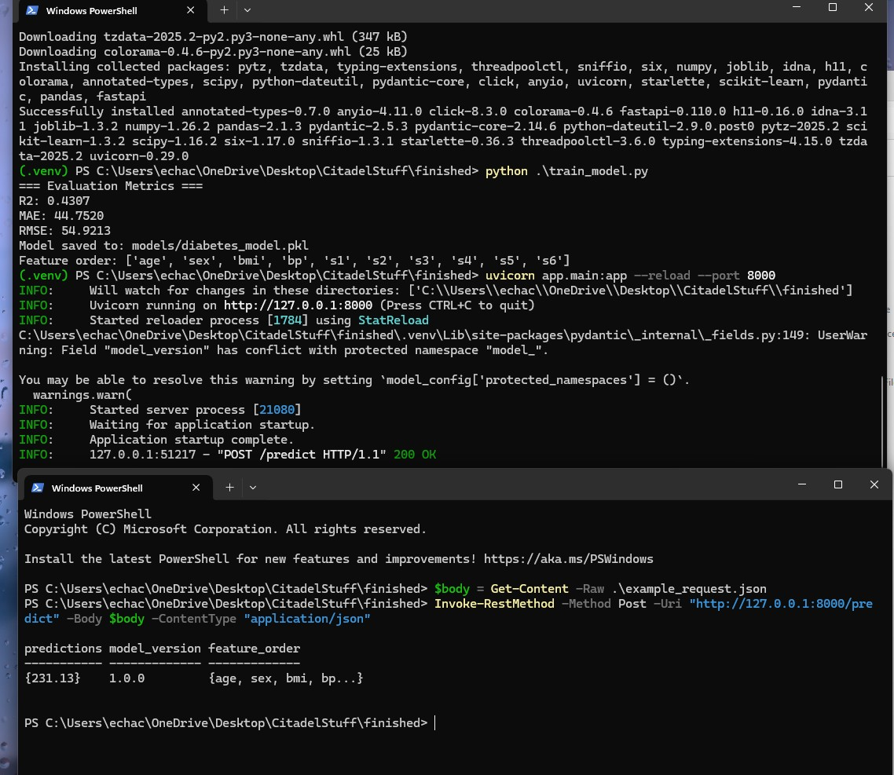
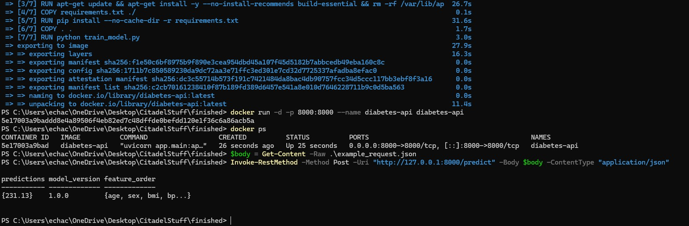

# FastAPI and Docker

This project demonstrates how to deploy a trained Machine Learning model as a FastAPI web service, both locally and in a Docker container.  
The model predicts diabetes progression values using the scikit-learn diabetes dataset and a RandomForestRegressor.


## Overview

The API exposes two endpoints:
- **GET /** — Health check to verify the service is running.
- **POST /predict** — Accepts a JSON body with patient data and returns the model’s predicted diabetes progression.

You can run this project:
1. Locally using Python and a virtual environment.
2. Inside Docker for an isolated, reproducible environment.


## Steps to Build, Run, and Test

### 1. Train the model locally
```powershell
python train_model.py
```
This script:
- Loads the diabetes dataset  
- Trains a RandomForestRegressor  
- Prints evaluation metrics (R², MAE, RMSE)  
- Saves the trained model in `models/diabetes_model.pkl`


### 2. Run the FastAPI app locally

#### A. Create and activate a virtual environment
```powershell
python -m venv .venv
. .venv\Scripts\Activate.ps1
```

#### B. Install dependencies
```powershell
pip install -r requirements.txt
```

#### C. Start the FastAPI app
```powershell
uvicorn app.main:app --reload --port 8000
```

#### D. Test using PowerShell
```powershell
$body = Get-Content -Raw .\example_request.json
Invoke-RestMethod -Method Post -Uri "http://127.0.0.1:8000/predict" -Body $body -ContentType "application/json"
```

You should see:
```
predictions   : {231.13}
model_version : 1.0.0
feature_order : {age, sex, bmi, bp, s1, s2, s3, s4, s5, s6}
```

### 3. Run the API inside Docker

#### A. Build the image
```powershell
docker build -t diabetes-api .
```

#### B. Run the container
```powershell
docker run -d -p 8000:8000 --name diabetes-api diabetes-api
```

#### C. Verify container is running
```powershell
docker ps
```
Expected output:
```
CONTAINER ID   IMAGE          COMMAND               STATUS          PORTS
xxxxxxx        diabetes-api   "uvicorn app.main…"   Up 10 seconds   0.0.0.0:8000->8000/tcp
```

#### D. Test using PowerShell (same as local)
```powershell
$body = Get-Content -Raw .\example_request.json
Invoke-RestMethod -Method Post -Uri "http://127.0.0.1:8000/predict" -Body $body -ContentType "application/json"
```

You should again receive predictions from the containerized API.

## Example Request and Responses

### Successful Prediction
**Request (`example_request.json`):**
```json
{
  "data": [{
    "age": 0.038075906,
    "sex": 0.050680118,
    "bmi": 0.061696207,
    "bp": 0.021872356,
    "s1": -0.044223498,
    "s2": -0.03482076,
    "s3": -0.043400846,
    "s4": -0.0025922629,
    "s5": 0.019908421,
    "s6": -0.017646125
  }]
}
```

**Response:**
```json
{
  "predictions": [231.13],
  "model_version": "1.0.0",
  "feature_order": ["age", "sex", "bmi", "bp", "s1", "s2", "s3", "s4", "s5", "s6"]
}
```

### Failed Prediction Examples

#### 1. Missing Field (Validation Error – 422)
**Request (missing `bmi`):**
```json
{
  "data": [{
    "age": 0.038075906,
    "sex": 0.050680118
  }]
}
```

**PowerShell Output:**
```
Status: 422 (UnprocessableEntity)
Body: {"detail":[{"loc":["data",0,"bmi"],"msg":"Field required","type":"missing"}]}
```

#### 2. Empty Data (Runtime Error – 400)
**Request:**
```json
{ "data": [] }
```

**PowerShell Output:**
```
Status: 400 (BadRequest)
Body: {"detail":"Prediction failed: Found array with 0 sample(s) (shape=(0, 10))"}
```

## Troubleshooting

| Issue | Cause | Fix |
|-------|--------|-----|
| `Model not found at models/diabetes_model.pkl` | forgot to train first | Run `python train_model.py` |
| `docker: command not found` | Docker not installed or running | Install [Docker Desktop](https://www.docker.com/products/docker-desktop/) and start it |
| Port already in use | Another process on port 8000 | Use a different port: `--port 9000` |
| PowerShell can’t activate venv | Script execution blocked | Run `Set-ExecutionPolicy -Scope CurrentUser RemoteSigned` |
| Dependencies conflict | Version mismatch | Delete `.venv` and reinstall from `requirements.txt` |
| File path issues on Windows | Using `@example_request.json` in curl | Use PowerShell `Get-Content -Raw .\example_request.json` instead |

## Pictures of Working Locally and with Docker

This one is when being run locally:


This one is being runned with Docker:

